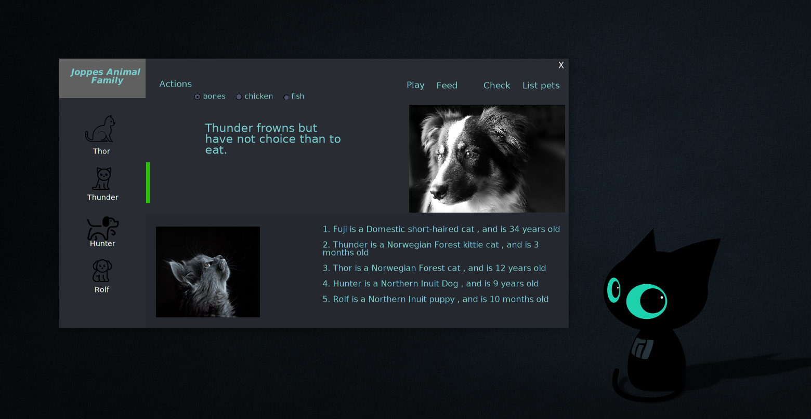

Compile the DarkUI app with the reference JoppesLib.dll and target is windows exe file no console 
mcs *.cs -pkg:dotnet -r:JoppesLib.dll -t:winexe 
mono Form1.exe  
 
create a class lib and compile as a library 
dotnet new classlib -o backend  
mcs -t:library JoppesLib.cs
